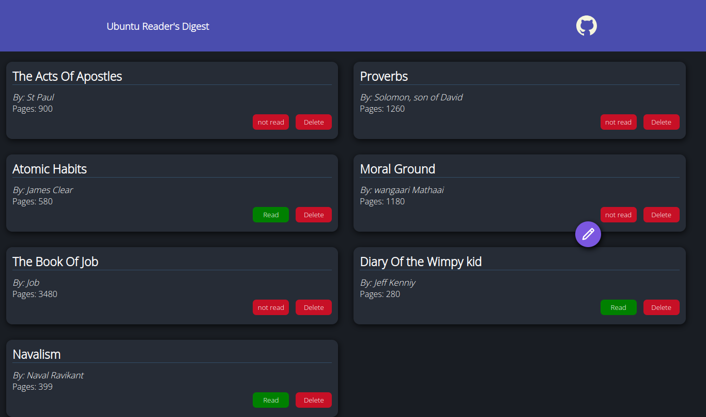
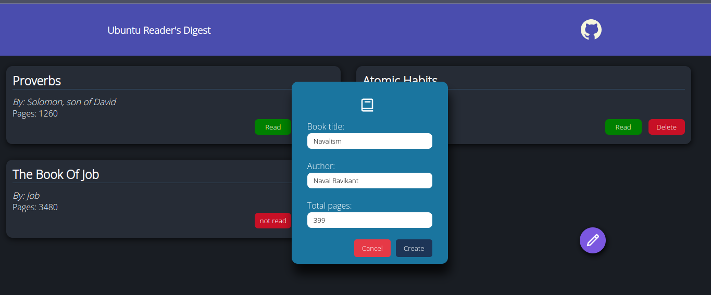
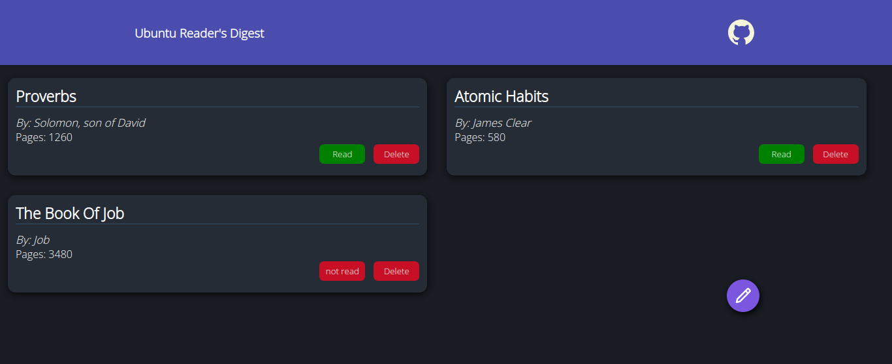
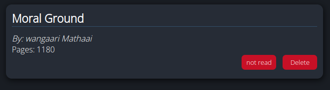
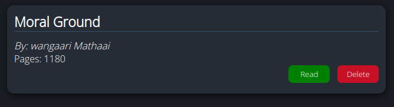

# Book Management System

        > *Screenshot of the Web application taken using chrome dev tools*
        

## Short Description 🎲

 A Book management system created for a user to keep track with all their current readings.A reader may add,delete and set reading statuses on their favourite reads.Built with HTML,vanilla CSS and vanilla Javascript.

 ## Demo 🚴
 click [Live Preview](https://mtendekuyokwa19.github.io/LibraryManager/) to check it out!

 ## Features and Aspects

1. Entering a new read

         > *Screenshot of dialog entry box*

2. Removing a book

                *the book titled Acts of Apostles and others have been removed*
3. Setting reading status  
                                                  *Reading status is `not read`*

*Reading status is `read`*       

 ## Technologies and Tools 	🔧

 1. HTML
 2. vanilla CSS
 3. Vanilla Javascript
 4. Chrome Dev tools
 5. Git
 6. Google fonts
 7. Figma And Figma community
 8. Github Pages
 

 ## What I learned 🎓
 - Objects, object Prototyping and Protocol Inheritance
 - DOM and DOM manipulation
 - Modular Programming

 ## Motivation 🧠
 - Creation of this project was lead by need to manage my own reads and also other.
 - It was also a way to practice my DOM manipulation and Object prototyping skils

 ## Credits 🤝

 - [Google Fonts](https://fonts.google.com/specimen/Quicksand?query=Quicksand).

 - [Figma Color palettes](https://www.figma.com/file/kVuVeHcwCENaBn4kKAxhGt/Dashboard---Dark-And-Light-Modes-%7C-Color-Variables-(Community)?type=design&node-id=7-1619&mode=design&t=ng4IU85pFsnxovSB-0)

## Future Update🔮
1. Addition of memory
2. fixing the create entry big and make create button unclickable using `event.preventDefault()` 
3. Charts and dates

